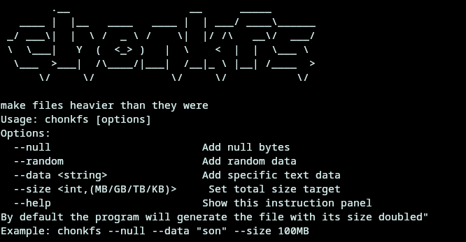

# chonkfs

<p align="center">
  
</p>

> make files heavier than they were.

`chonkfs` is a tiny C utility that unnecessarily increases file sizes while keeping the original file functional.

Why?
No reason.
Maybe a prank.
Maybe psychological warfare.
Maybe your 2MB image deserves to identify as 14GB.

<<<<<<< HEAD

=======
---
>>>>>>> 62e8dc2 (docs(readme): expand README with banner, description, features, and usage)

## elevator pitch 📢

What if you could make files absurdly heavy for absolutely no reason?

`chonkfs` copies a file and injects extra junk data into it:
- random bytes
- null bytes
- repeated patterns
- pure digital obesity

The original file still works (most of the time).
The size becomes deeply concerning.

<<<<<<< HEAD
=======
---
>>>>>>> 62e8dc2 (docs(readme): expand README with banner, description, features, and usage)

## features

- lightweight single-binary utility
- works on Linux and Windows
- supports multiple chonking modes
- keeps original file untouched
- append-only design for maximum survivability
- no dependencies
- written in raw C because suffering builds character

<<<<<<< HEAD

=======
---
>>>>>>> 62e8dc2 (docs(readme): expand README with banner, description, features, and usage)

## usage

```bash
<<<<<<< HEAD
chonkfs file
```

> [!WARNING]
> ⚠️ WIP
>
> `chonkfs` is still heavily work-in-progress.
>
> Things may:
> - corrupt files
> - have incomplete features
> - behave differently across platforms
>
> Use at your own risk.
=======
<<<<<<< HEAD
chonkfs file.mp4 --random 500MB
=======
chonkfs file.mp4 --random 500MB
>>>>>>> 62e8dc2 (docs(readme): expand README with banner, description, features, and usage)
>>>>>>> 9f9d8eb (feat: add --size option and optimize data generation; clean README)
